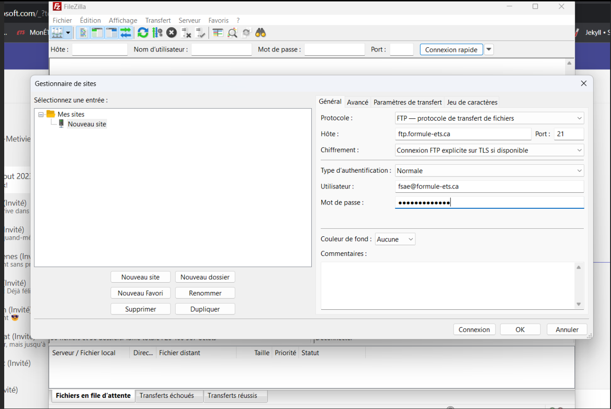

# FormuleEts

- [Production website](https://formule-ets.ca/)
- [Developement website](https://formuleets-dev.netlify.app/)

## How to run ?

```
export NODE_OPTIONS=--openssl-legacy-provider

set NODE_OPTIONS=--openssl-legacy-provider  &&  npm run serve
npm run server-local
```

## How to really run (Windows) ?
- Download or update Node.js (verify version with npm -v)
- Open terminal and go under SiteFormuleETS\frontend\formuleets
- Enter ``` $env:NODE_OPTIONS="--openssl-legacy-provider" ```
- Verify environment variable with ``` Get-Childitem -path env: ```
- ``` npm install ```
- ``` npm run serve ```

## How to deploy
- Installer Filezilla
- ```npm run build```
- Trouver le dossier dist dans ton projet
- Allez sur Web Hosting Canada -> Hosted Website -> cpanel
- 
- Clique droit + Update